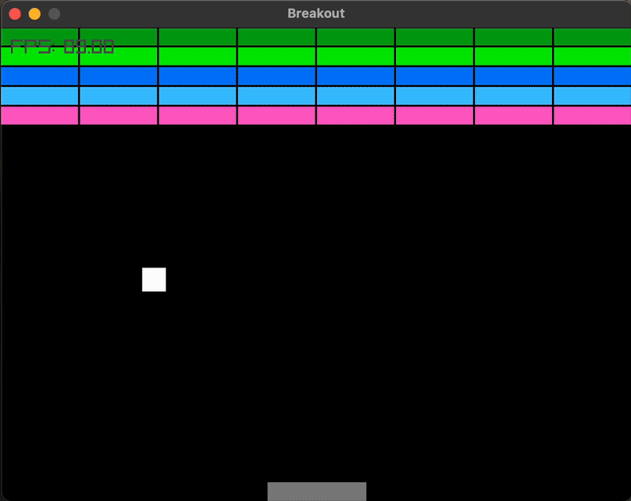
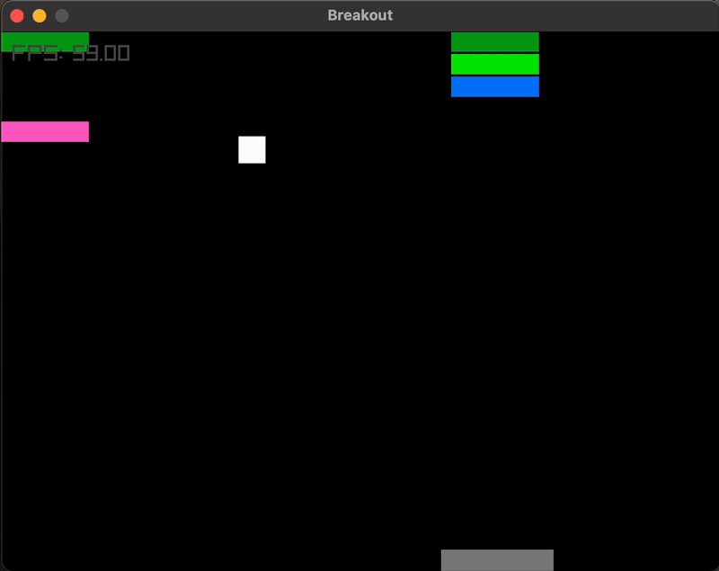
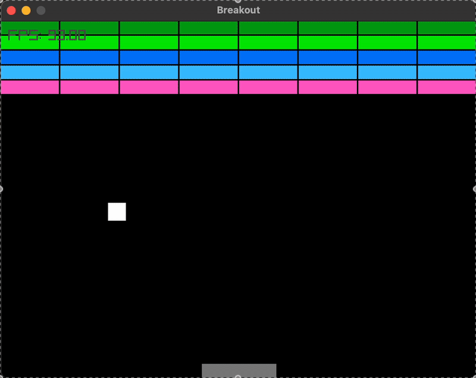

# Breakout ECS

Un clon de **Breakout** implementado con **ECS** (EnTT) y **Raylib** en C++.

---

## Descripción 

- El jugador controla un **paddle** que solo se mueve horizontalmente.
- Hay una **pelota** que rebota contra paredes, paddle y bloques.
- Cada rebote contra paredes o paddle acelera ligeramente la pelota.
- Si la pelota toca el suelo, pierdes.
- Cuando destruyes todos los bloques, ganas.

---

## Demostraciones

| Jugando                                      | 
|---------------------------------------------|
|                     |

|You Win                                    |
|--------------------------------------------|
|                     | 

| You Lost                 |
|--------------------------|
|  |


## Estructura del Proyecto
```plaintext
Breakout-ECS/
├── CMakeLists.txt
├── external/
│   └── entt/…            # headers de EnTT
├── src/
│   ├── Game/…            # Clase base Game
│   ├── Breakout/…        # Breakout, Systems
│   ├── ECS/…             # Components, Entity, System
│   └── Scene/…           # Scene.h/.cpp
│   └── main.cpp
└── README.md
```
